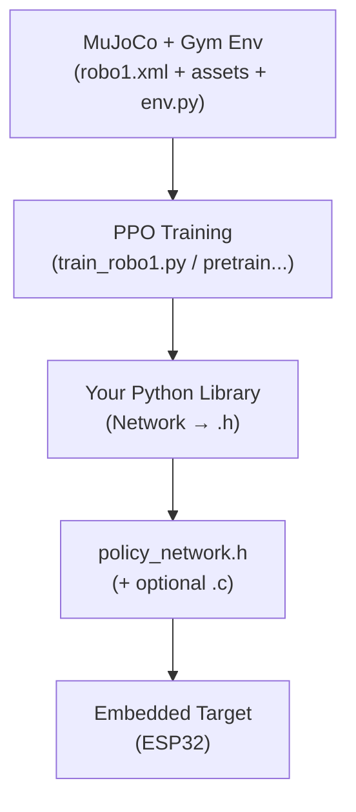
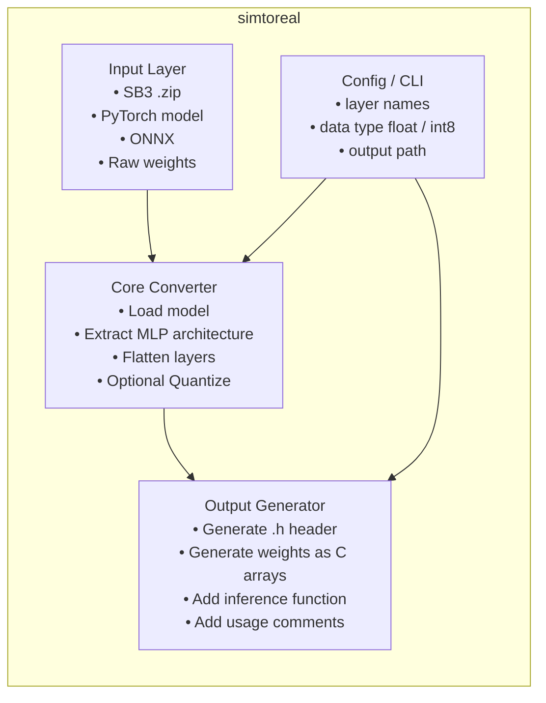
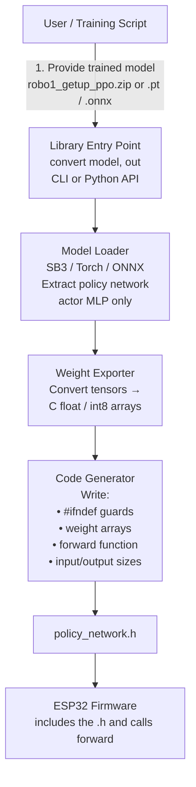

# simtoreal
## Library Specification & Architecture

**Library name:** `simtoreal`
**Target platform:** ESP32
**Purpose:** Convert a trained PPO policy network (Stable-Baselines3) into a C header file (`.h`) that runs inference directly on an ESP32, using an IMU-based observation input.

---

## 1. Scope

`simtoreal` sits between the training side and the hardware side of the pipeline. The library's only job is converting a trained model into a working `.h` file. It does not train models, does not run on the ESP32 itself, and does not (yet) verify correctness — that is a later phase.

## Where the library sits

## Structure

## WorkFlow

